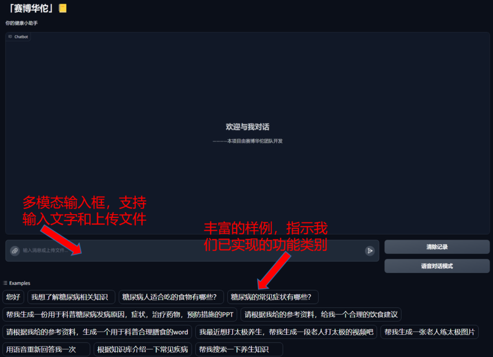
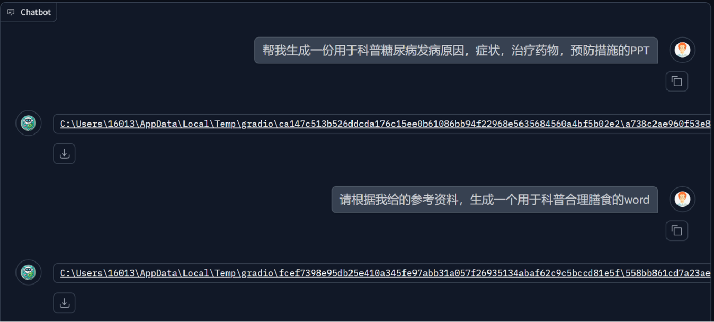

 

<h1 align="center">「赛博华佗」· cyber-doctor 你的健康小管家</h1>

**语言**

- [English](./README_en.md)
- [中文](./README.md)

---

## 项目演示视频

https://www.bilibili.com/video/BV1CU2aYpEn2

## 项目背景

医疗资源不平衡长期存在，尤其是欠发达地区难以及时触达优质医疗资源。随着多模态大语言模型的快速发展，我们希望搭建一个可扩展的医疗知识助手，从病历理解、基础问诊到健康知识科普都能提供智能支持。赛博华佗基于东南大学暑期实训课程完成开发，目标用户是所有关注自身健康的人，同时也为其他垂直领域提供可复用的多模态智能体脚手架。

## 新版亮点

- **Django + JWT 认证服务**：新增独立认证后台，并与 Gradio 前端深度整合，支持注册、登录、刷新、注销及黑名单机制。
- **多用户知识库隔离**：登录后自动将知识库文件写入 user_data/<user_id>，RAG 向量库按用户隔离，支持上传、查看、删除并重建。
- **会话持久化 API**：Django chat 应用提供 REST 接口，Gradio UI 可切换历史会话并同步消息，方便与第三方系统集成。
- **可插拔模型调用**：兼容智谱、DeepSeek、阿里通义、硅基流动、Ollama 等多家模型，沿用 OpenAI SDK 调用方式，可在配置中自由切换。
- **桌面级交互体验**：登录状态本地缓存、侧边栏可折叠、拖拽上传，多模态输入（文本/图片/音频/视频）整合在统一界面。

## 界面展示

### 文本交流界面

### 语音对话界面

## 功能特色

- **多模态智能体编排**：根据问题自动识别任务类型，组合文本、图像、音频、视频模型协同处理复杂请求。
- **检索增强一体化**：知识库 RAG、知识图谱、联网搜索三管齐下，提高回答的准确性与时效性。
- **语音全链路能力**：内置 Whisper 语音识别与 Edge-TTS 语音合成，支持语音输入和语音播报。
- **办公文档自动化**：一键生成 PPT、Word 等办公文档，并提供下载链接。
- **账户与会话体系**：登录后开启个人知识库目录与会话历史，支持 token 刷新与黑名单。
- **可扩展工具集**：通过 LangChain 工具路由快速挂载自定义函数或外部系统。
- **多模型接入**：支持远程云端模型、本地 Ollama 封装及自建模型 API。

## 功能介绍

| 功能             | 功能介绍                                                                                                                     |
| ---------------- | ---------------------------------------------------------------------------------------------------------------------------- |
| 多轮对话         | 保留上下文记忆，支持图片、音频、文档混合输入，自动在知识库、知识图谱、联网模式之间切换。                                     |
| 图片识别 / 生成  | 借助多模态大模型识别病历、药品说明等图像信息，也可生成宣教素材或插画。                                                      |
| 视频生成         | 调用智谱 AI 视频生成能力，快速产出短视频或动画脚本。                                                                         |
| PPT / Word 生成  | 结合提示模板生成结构化内容，并导出为 Office 文档。                                                                            |
| 语音输入 / 输出  | 语音对话模式下自动调用 Whisper 识别与 Edge-TTS 合成，支持多语种与方言。                                                      |
| 检索增强生成     | 知识库、知识图谱、联网检索三种 RAG 工具按需触发，引用外部资料提供可溯源答案。                                                |
| 多用户知识库     | 登录后分配独立文件目录，支持上传/查看/删除文件并重建个人向量库。                                                             |
| 会话管理         | 认证后自动创建会话，可在前端切换历史记录，同时通过 REST API 与外部系统同步。                                                 |
| 联网检索增强     | 自动爬取网络数据、提取摘要并引用来源，保证回答的新鲜度。                                                                    |

## 典型功能展示

### 病历识别

### PPT/Word 生成

### 知识图谱检索增强

### 联网检索增强

## 技术栈

- **Python 3.10+**
- **Gradio 5**：新版 UI 组件，支持自定义 CSS/JS 与本地状态缓存。
- **Django 5 + Redis**：认证、会话、token 黑名单管理（Redis 可选）。
- **LangChain / LangChain Community**：工具编排与 RAG 链路。
- **PyTorch & Transformers**：多模态与文本生成模型底座。
- **ModelScope Embeddings + FAISS**：知识库文本向量化与检索。
- **Edge-TTS / Whisper / SpeechRecognition**：语音合成与识别。
- **httpx / APScheduler / PyJWT**：网络请求、任务调度与令牌管理。

## 如何启动项目

1. **克隆仓库**
   `ash
   git clone https://github.com/yazesong/cyber-doctor.git
   # 或使用 SSH
   git clone git@github.com:yazesong/cyber-doctor.git
   cd cyber-doctor
   `
2. **创建并激活 Python 环境（建议 3.10）**
   `ash
   python -m venv .venv
   # Windows
   .\.venv\Scripts\activate
   # macOS / Linux
   source .venv/bin/activate
   `
   *可选：使用 Conda 时执行 conda create -n cyber-doctor python=3.10 && conda activate cyber-doctor。*
3. **安装项目依赖**
   `ash
   pip install --upgrade pip
   pip install -r requirements.txt
   `
   若需 GPU 版本，可按需替换 	orch 安装源。
4. **复制并填写环境变量**
   - 复制 .env.example 为 .env（Windows 可执行 copy .env.example .env）。
   - 填写主模型的 LLM_BASE_URL、LLM_API_KEY、MODEL_NAME。
   - 生成随机的 DJANGO_SECRET_KEY、JWT_SECRET_KEY，根据需求调整 token 生命周期。
   - 配置 AUTH_SERVER_BASE_URL、GRADIO_HOST、GRADIO_PORT 等服务地址。
5. **完善 YAML 配置**
   - 编辑 config/config-web.yaml，确认知识库目录（默认 ./konwledge-base）、ModelScope 下载路径以及 Neo4j 连接信息。
   - 如需调整检索参数（chunk 大小、召回数量等），可在该文件或对应模块中修改。
6. **准备可选组件**
   - **Redis（推荐）**：负责 refresh token 与黑名单存储。
     `ash
     docker run -d --name cyber-redis -p 6379:6379 redis:7
     `
     将连接串写入 .env 的 REDIS_URL，未配置时系统会自动回退到 uthserver/token_store.json。
   - **Neo4j 知识图谱（可选）**：安装 Neo4j 社区版或使用 Docker，配置 config/config-web.yaml 中的连接信息。可从 [OpenKG](http://openkg.cn/datasets-type/1) 获取医疗图谱，使用 
eo4j-admin database load 导入，必要时执行 
eo4j-admin database migrate。
   - **FFmpeg（语音功能）**：请安装 FFmpeg 并确保命令可用，以便 pydub、whisper 处理音频。
7. **初始化 Django 认证服务**
   `ash
   python authserver/manage.py migrate
   # 可选：创建后台管理员
   python authserver/manage.py createsuperuser
   python authserver/manage.py runserver 0.0.0.0:8000
   `
   认证服务基于 JWT，可选接入 Redis 黑名单，详细接口见 [docs/authentication.md](docs/authentication.md)。
8. **启动 Gradio 多模态前端**
   `ash
   python app.py
   `
   如需外网访问，可在 .env 中将 GRADIO_HOST 设置为 .0.0.0 或开启 GRADIO_SHARE=true。
9. **注册、登录并体验功能**
   - 浏览器访问 http://<GRADIO_HOST>:<GRADIO_PORT>。
   - 在顶部登录面板完成注册/登录，登录状态会同步到本地存储并写入 user_data/<user_id>。
   - 通过侧边栏上传知识库文件、重建向量库，或直接发起文本/语音/图像对话；所有会话将同步到 Django chat API，方便外部系统读取。

## 环境变量速览

`ini
# 大模型与多模态
LLM_BASE_URL=https://open.bigmodel.cn/api/paas/v4
LLM_API_KEY=请填写
MODEL_NAME=glm-4.5-flash
IMAGE_GENERATE_API=
IMAGE_GENERATE_MODEL=cogview-3-flash
IMAGE_DESCRIBE_API=
IMAGE_DESCRIBE_MODEL=glm-4v-flash
VIDEO_GENERATE_API=
VIDEO_GENERATE_MODEL=cogvideox-flash

# 运行环境
PY_ENVIRONMENT=web
GRADIO_HOST=127.0.0.1
GRADIO_PORT=10032
GRADIO_SHARE=false

# Django 认证
DJANGO_SECRET_KEY=随机字符串
DJANGO_DEBUG=false
DJANGO_ALLOWED_HOSTS=127.0.0.1,localhost
DJANGO_DB_PATH=authserver/db.sqlite3  # 可选：自定义数据库路径

# JWT & Redis
JWT_SECRET_KEY=随机字符串
JWT_ALGORITHM=HS256
ACCESS_TOKEN_LIFETIME_MINUTES=60
REFRESH_TOKEN_LIFETIME_DAYS=7
AUTH_TOKEN_NAMESPACE=cyber_doctor
REDIS_URL=redis://127.0.0.1:6379/0

# 服务地址
AUTH_SERVER_BASE_URL=http://127.0.0.1:8000
`

- 未配置的多模态接口会自动禁用对应功能，可按需填入智谱、火山、硅基等平台的密钥。
- 若部署在公网，请同步更新 DJANGO_ALLOWED_HOSTS、GRADIO_SHARE，并为 JWT 密钥使用高强度随机字符串。
- PY_ENVIRONMENT 支持切换不同的 YAML 配置文件（如 config/config-web.yaml）。

## 项目结构

`	ext
cyber-doctor/
├── .env.example                   # 环境变量示例（复制后修改为 .env 使用）
├── .gitignore                     # Git 忽略规则
├── LICENSE                        # 开源协议
├── README.md                      # 中文说明文件
├── README_en.md                   # 英文说明文件
├── requirements.txt               # Python 依赖清单
├── env.py                         # .env 读取封装
├── app.py                         # Gradio 前端入口，负责认证、会话、多模态编排
├── audio/                         # 语音能力模块（ASR/TTS）
│   ├── audio_extract.py           # 音频裁剪与格式转换
│   ├── audio_generate.py          # 文本转语音封装
│   └── __init__.py
├── authserver/                    # Django 认证与会话服务
│   ├── manage.py                  # Django 管理入口
│   ├── authserver/                # Django settings、URL、ASGI/Wsgi
│   ├── core/                      # JWT 配置、token 存储、工具函数
│   ├── users/                     # 注册 / 登录 / 刷新 / 注销接口
│   └── chat/                      # 会话、消息模型与 REST API
├── client/                        # 大模型客户端适配层
│   ├── clientfactory.py           # 客户端工厂
│   ├── LLMclientbase.py           # 抽象基类
│   ├── LLMclientgeneric.py        # OpenAI 协议兼容实现
│   ├── ourAPI/                    # 自建/本地模型封装
│   └── zhipuAPI/                  # 智谱 API 封装
├── config/                        # 配置中心
│   ├── config-web.yaml            # 默认运行配置（知识库、Neo4j、缓存等）
│   └── config.py                  # YAML + .env 解析工具
├── data/                          # 运行缓存/示例数据（如联网检索缓存）
│   └── cache/
├── docs/                          # 项目文档
│   └── authentication.md          # 认证服务部署与 API 说明
├── Internet/                      # 联网检索链路
│   ├── Internet_chain.py
│   ├── Internet_prompt.py
│   └── retrieve_Internet.py
├── kg/                            # 知识图谱封装
│   └── Graph.py
├── konwledge-base/                # 默认知识库目录（可放公共素材）
├── model/                         # 检索 / 图谱 / 联网模型实现
│   ├── model_base.py              # 模型生命周期管理
│   ├── Internet/                  # 联网 RAG 向量库
│   ├── KG/                        # 图谱匹配自动机
│   └── RAG/                       # 本地知识库构建与检索
├── ppt_docx/                      # 文档自动生成模块
│   ├── ppt_content.py
│   ├── ppt_generation.py
│   ├── docx_content.py
│   └── docx_generation.py
├── qa/                            # 问答链路与工具函数
│   ├── answer.py
│   ├── function_tool.py
│   ├── prompt_templates.py
│   ├── purpose_type.py
│   └── question_parser.py
├── rag/                           # 检索增强链式调用
│   ├── rag_chain.py
│   └── retrieve/                  # 文档检索工具
├── resource/                      # 静态资源（头像等）
├── README/                        # README 插图
└── __init__.py                    # Python 包初始化
`

## 认证与会话 API

认证接口统一挂载在 AUTH_SERVER_BASE_URL 下的 /auth/ 路径，返回 JSON：

| 方法 | 路径              | 说明                                         |
| ---- | ----------------- | -------------------------------------------- |
| POST | /auth/register/ | 注册账号，参数：username、password      |
| POST | /auth/login/    | 登录，返回 access/refresh token             |
| POST | /auth/refresh/  | 刷新令牌，默认轮换 refresh token            |
| POST | /auth/logout/   | 注销，需携带 Authorization: Bearer <token>，并在 body 中提供 
efresh_token |
| GET  | /auth/me/       | 获取当前用户信息                             |

会话接口位于 /chat/ 路径，需要在请求头附带 Authorization: Bearer <access_token>：

| 方法 | 路径                                    | 说明                           |
| ---- | --------------------------------------- | ------------------------------ |
| GET  | /chat/sessions/                       | 列出当前用户的全部会话         |
| POST | /chat/sessions/                       | 新建会话，可指定标题           |
| GET  | /chat/sessions/<session_id>/messages/ | 获取指定会话的消息历史         |
| POST | /chat/sessions/<session_id>/messages/ | 写入消息，字段：sender、content、可选 model_id |

更多细节、请求示例与开发建议请参考 [docs/authentication.md](docs/authentication.md)。

## 项目现状

当前版本已从原本的 Django + Vue 架构剥离，Gradio 成为主要交互入口；认证、会话、知识库等模块抽象为独立服务/组件，便于替换和扩展。知识图谱检索仍有优化空间（如关系类型过滤、权重调优），欢迎提交 Issue 或 PR 共同完善。

## 贡献者

感谢以下成员的贡献（按字母顺序）：

- [Goku-30](https://github.com/Goku-30)
- [L-MARK](https://github.com/L-MARK)
- [YM](https://github.com/YM556)
- [laobaishui](https://github.com/laobaishui)

以及所有开源贡献者：

## 参考项目

- [meet-libai](https://github.com/BinNong/meet-libai)

## Star History

<a href="https://star-history.com/#warma10032/cyber-doctor&Date">
 <picture>
   <source media="(prefers-color-scheme: dark)" srcset="https://api.star-history.com/svg?repos=warma10032/cyber-doctor&type=Date&theme=dark" />
   <source media="(prefers-color-scheme: light)" srcset="https://api.star-history.com/svg?repos=warma10032/cyber-doctor&type=Date" />
   
 </picture>
</a>

## 用户认证与权限

仓库已内置基于 Django 的认证服务（支持 JWT 与可选 Redis 黑名单机制），并与 Gradio 前端完成集成。配置方法、API 列表、运行顺序等详情请参考 [docs/authentication.md](docs/authentication.md)。
