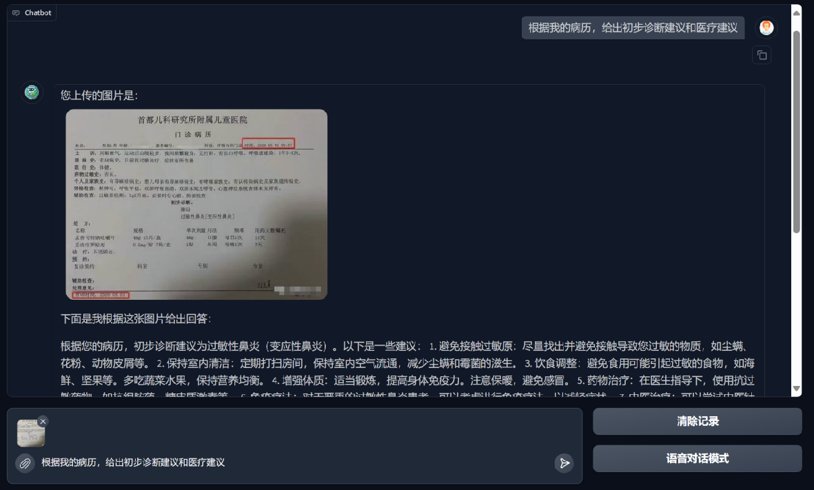

<div align="center">
 
</div>


<h1 align="center">「赛博华佗」🩺 cyber-doctor 你的健康小管家</h1>


------


## 项目演示视频

https://www.bilibili.com/video/BV1CU2aYpEn2


## 项目背景

医疗资源不平衡一直以来是社会关注的重点问题，它导致众多医疗不公平事件发生。在相对落后地区的人们想要获得优秀的医疗资源往往需要前往一线城市，这不仅费时费力费钱，而且极大的影响了他们的接受医疗救助的基本权利。当前多模态大语言模型不断发展，在许多领域都有了不错的应用。我们小组基于东南大学暑期实训课程，开发了一个医疗健康领域的多模态大模型，这个大模型的目标用户是所有对自己健康关心的人，帮助进行基本的疾病诊断，病历分析，专业知识答疑等功能。本项目狭义上可以作为一个多功能的健康小助手，帮助管理个人健康，提供基础的医疗建议；广义上可以配置在任何领域，通过微调的大模型和RAG技术让大模型掌握目标领域的专业知识，成为任意专业的专家。


## 界面展示

### 文本交流界面


### 语音对话界面


## 功能特色

- **多功能多模态整合，借助AI智能体判断任务的种类，将多个模型整合工作，解决复杂问题。**

- **单独的语音对话模块，语音输入语音输出，只需要会说话就能使用，降低大模型学习成本。**


## 功能介绍


| 功能         | 功能介绍                                                     |
| ------------ | ------------------------------------------------------------ |
| 图片识别     | 借助多模态大模型的能力，识别图片中的图像和文字。可用于识别病历，识别药品说明书等 |
| 视频生成     | 借助多模态大模型的能力，生成视频                             |
| 图片生成     | 借助多模态大模型的能力，生成图片                             |
| ppt/word生成 | 可自动生成固定格式的纯文字PPT和Word文档                      |
| 多轮对话     | 具有记忆功能，对话界面的所有内容会作为历史记录一同输入大模型 |
| 检索增强对话 | 多模态输入框不只能输入文本，还能上传文件。大模型会根据文件内容调整输出 |
| 语音输入     | 多模态输入框可以上传音频文件。进入语音对话模式可以直接使用麦克风进行语音输入 |
| 语音输出     | 要求大模型以语音的形式进行输出时，大模型会返回一段音频，支持多种方言，在语音对话模式下默认以语言形式输出 |
| 知识图谱增强 | 支持配置相关领域的neo4j知识图谱，用专业知识改善大模型输出    |
| 知识库增强   | 支持利用多种格式的文件作为专属知识库，大模型会结合知识库中的文件进行输出 |
| 联网检索增强 | 通过自动化爬虫检索网络上的相关信息，利用网络增强大模型知识的时效性 |


## 典型功能展示

### 病历识别



### PPT/Word生成


### 知识图谱检索增强：


### 联网检索增强：


## 技术栈

- Python

- PyTorch

- Transformers

- Gradio：简易的UI和交互生成工具

- Langchain：基于 Langchain 框架，构建语言模型进行链式操作

- modelscope & huggingface：预训练大模型的下载与配置

- RAG：结合检索与生成的技术，用于增强生成式模型的回答质量

- Knowledge Graph (Neo4j)：Neo4j图数据库的配置和Cypher语句操作

- TTS (edge-tts)，STT (whisper)：语音转文本，文本转语音

- OpenAi & zhipuai：相关大模型sdk调用方法

Option：

- Ollama：本地大模型api封装


## 如何启动项目

1. **从Github上拉取项目**

   ```bash
   git clone https://github.com/Warma10032/cyber-doctor.git
   或者
   git clone git@github.com:Warma10032/cyber-doctor.git
   ```

2. **配置大模型API**

   复制`.env.example`为`.env`，填写`.env`内相关API配置。

   API目前支持：

   [智谱AI ](https://open.bigmodel.cn/)

   OpenAI（未测试，调用的是openai的sdk，理论上可以）

   Ollama封装的本地API

   由于团队本身缺少申请/测试多家API的能力，可能会有各种bug，欢迎各位提出相关的issue和merge一起来解决API适配问题，你的行动是对开源社区最大的帮助。

3. **填写`config/config-web.yaml`配置文件**

4. **创建python环境（python>=3.10，建议为3.10）**

   建议使用conda管理环境

   ```bash
   conda create --name myenv python=3.10
   conda activate myenv
   ```

   安装依赖库

   ```bash
   pip install -r requirements.txt
   ```

5. **启动项目**

   ```bash
   python app.py
   ```
   
   启动后访问 http://localhost:7860

Option：

1. **下载Neo4j图数据库（使用知识图谱检索增强功能的必要条件）**

   推荐教程：

   - [Windows系统下Neo4j安装教程——CSDN博客](https://blog.csdn.net/jing_zhong/article/details/112557084)
   
   - [Docker化部署Neo4j](https://cloud.baidu.com/article/3314714)
   
   提醒：
   
   - 免费的社区版即可，能创建一个图数据库
   
   - 创建时记住用户名和密码
   
   - 填写config/config-web.yaml配置文件
   
   - 记得启动Neo4j服务
   
2. **配置一个专业领域的图数据库**

   推荐开源知识图谱平台：[OpenKG](http://openkg.cn/datasets-type/)

   如果想配置医疗健康领域的数据库，推荐下载如下开源知识图谱

   [面向家庭常见疾病的知识图谱](http://data.openkg.cn/dataset/medicalgraph)（本项目使用了该图谱，使用该图谱可以不更改config/config-web.yaml的相关配置文件）
   
   1. 下载到本地后，改.dump文件名为你要导入的数据库名称（eg：neo4j.dump）
   
   2. 关闭neo4j服务
   
      ```
      Windows: neo4j stop
      Linux: sudo neo4j stop
      ```
   
   3. 运行导入指令（这一步简中互联网上找不到正确的教程😡）
   
      ```
      neo4j-admin database load <database-name> --from-path=/path/to/dump-folder/ --overwrite-destination=true
      ```
   
      `--from-path`：存放对应"database-name".dump文件的文件夹路径
   
      `--overwrite-destination`：**注意会覆盖你原先数据库中的数据**
   
   4.  若运行上面的命令后输出
   
      ```
      The loaded database 'neo4j' is not on a supported version (current format: AF4.3.0 introduced in 4.3.0). Use the 'neo4j-admin database migrate' command
      ```
   
      还需要运行如下命令
   
      ```
      neo4j-admin database migrate <database-name>
      ```
   
   5. 启动neo4j服务
   
      ```
      Windows: neo4j start
      Linux: sudo neo4j start
      ```
   
      

## 项目结构

| 文件                      | 描述                                                         |
| ------------------------- | ------------------------------------------------------------ |
| **app.py**                | **项目启动文件。包含构建gradio界面，处理界面中的多模态信息等函数。可以更改stt模型，自定义gradio界面** |
| env.py                    | 封装读取.env文件的接口                                       |
| audio                     | 存放所有与音频生成相关的文件                                 |
| /audio_extract.py         | 大模型特征工程，提取要进行tts的文本和语种                    |
| /audio_generate.py        | 封装调用edge-tts接口                                         |
| client                    | 存放大模型代理（用户与大模型API之间的桥梁）生成的相关文件    |
| **/clientfactory.py**     | **封装构建不同大模型代理的接口，构建完成后返回一个大模型代理** |
| **/LLMclientgeneric.py**  | **封装调用大模型代理的API接口的函数**                        |
| config                    | 存放进一步的配置文件                                         |
| Internet                  | 存放联网搜索增强相关的文件                                   |
| /Internet_prompt.py       | 大模型特征工程，提取搜索关键词                               |
| /retrieve_Internet.py     | 调用model/Internet中的接口，检索搜索到的资料                 |
| /Internet_chain.py        | 联网搜索链，调用了上面两个文件中的函数，先提取关键词，再搜索爬取，最后检索。 |
| kg/Graph.py               | 实例化知识图谱对象                                           |
| model                     | 存放检索增强相关的文件，包括联网RAG、知识库RAG的向量库的构建，知识图谱RAG的匹配自动机的构建 |
| **/*_model.py**           | **各种检索模型类的定义**                                     |
| /*_service.py             | 向外部提供检索模型的接口                                     |
| ppt_docx                  | 存放ppt/word生成相关的文件                                   |
| /*_content.py             | 大模型特征工程，让大模型输出json格式的数据                   |
| /*_generation.py          | 将大模型生成的json数据转换为ppt/word，可修改代码自定义ppt/word的样式 |
| **qa**                    | **存放问答交互相关的文件，连接app.py与相关功能模块，项目核心** |
| **qa/answer.py**          | **根据问答类型选择对应的工具函数进行处理**                   |
| **qa/function_tool.py**   | **存放处理不同问答类型的工具函数，核心文件**                 |
| **qa/question_parser.py** | **问答类型判断函数，根据输入关键词和大模型进行分类。eg：“根据知识库...”，“根据知识图谱...”，“联网搜索...”，“生成word...“** |


## 项目现状

项目从原本Django+vue框架中分离，在开发时我们是设计了一个简单的前后端框架和界面的。可以提供简单的登录、注册、创建用户自己的知识库和可交互的对知识库进行增删改查的功能。但由于该部分不是本人负责，我对如何教大家如何配置该部分代码还不是很懂，各位如果希望本项目能提供相关功能，欢迎反馈，我再对项目进行更新。

你可能发现了本项目类似一个大杂烩，将众多功能缝合到了一起。但其实在单独的每个功能实现上，还有很大的优化空间。

例如对知识图谱的处理，目前只是匹配所有实体和与该实体直接相连的关系。其实可以增添对关系类型的判断等，优化知识图谱对大模型输出的影响，避免干扰大模型的输出。这些将在我有时间的时候进行更新，也欢迎你的意见与建议，敬请期待吧。


## 贡献者

感谢以下成员对项目的贡献

团队成员：

- [YM](https://github.com/YM556)

- [L-MARK](https://github.com/L-MARK)

- [Goku-30](https://github.com/Goku-30)

- [laobaishui](https://github.com/laobaishui)

开源领域大神（除了我）：

<a href="https://github.com/Warma10032/cyber-doctor/contributors">
  </a>


## 参考项目

本项目参考了以下开源项目，感谢他／她们的付出

- [meet-libai](https://github.com/BinNong/meet-libai)