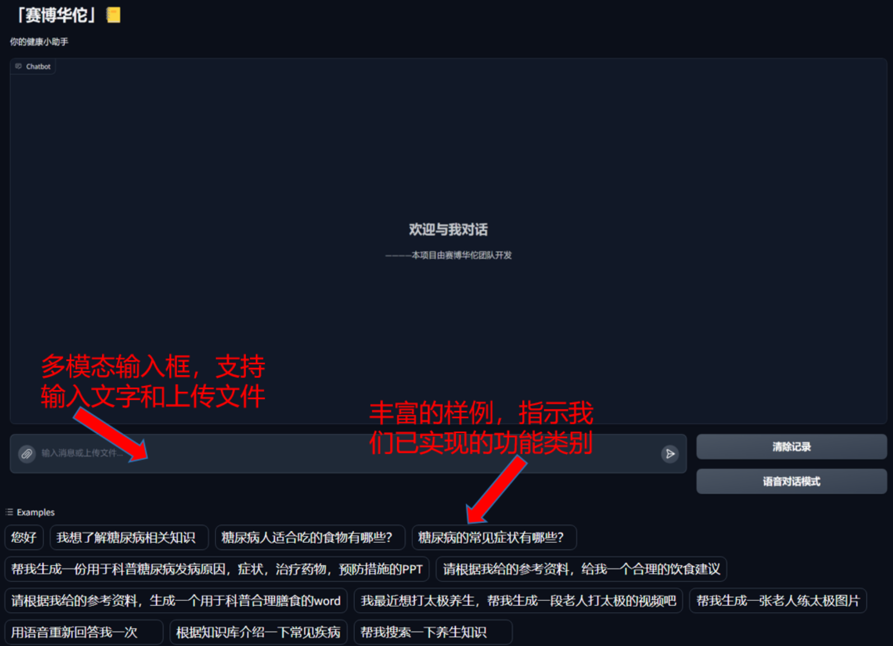
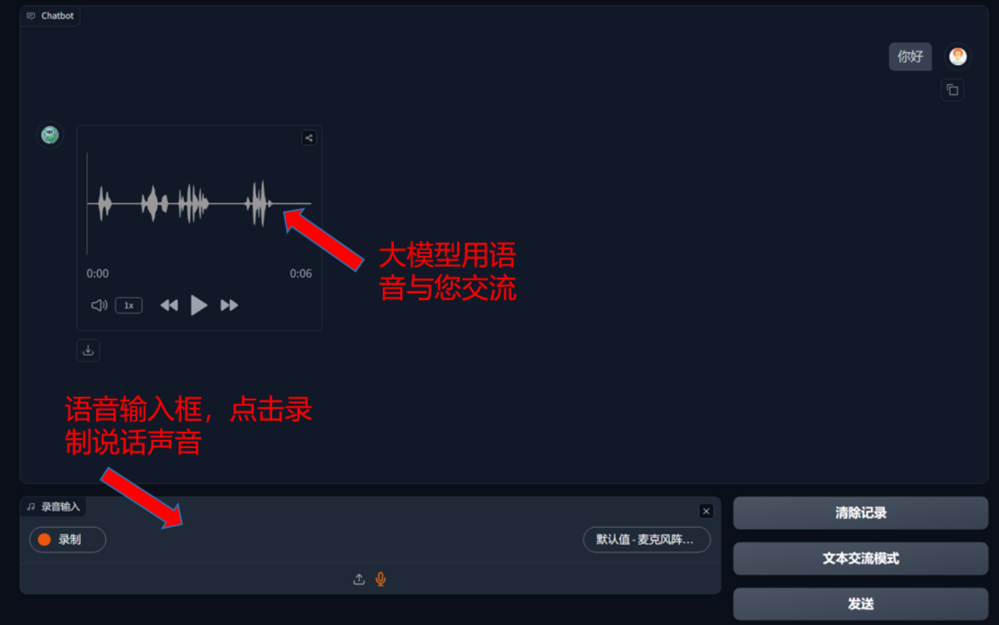
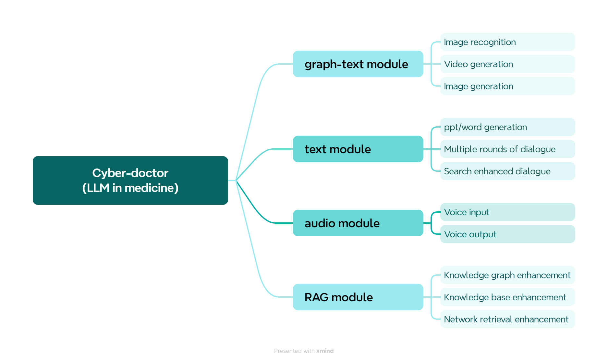
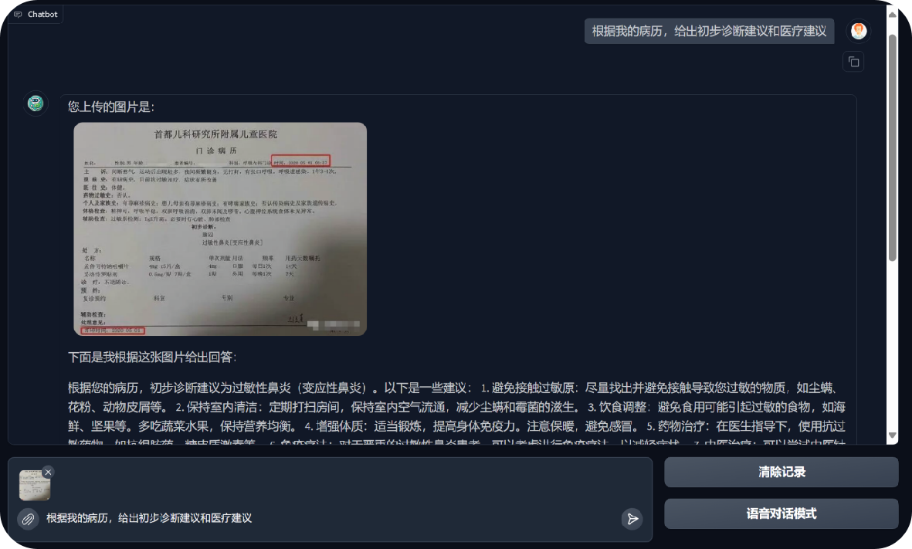
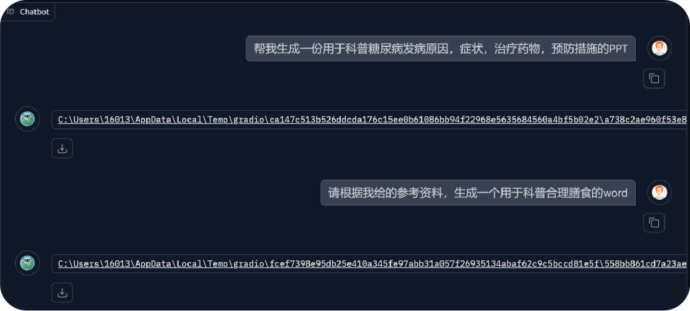
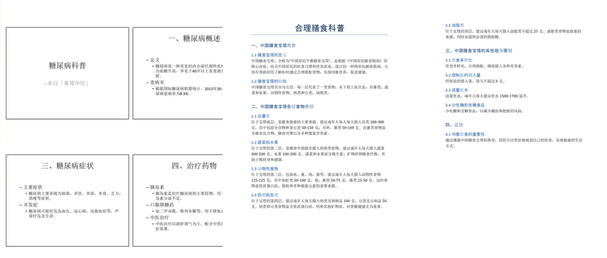
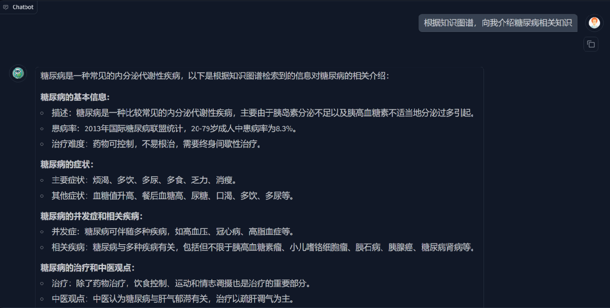
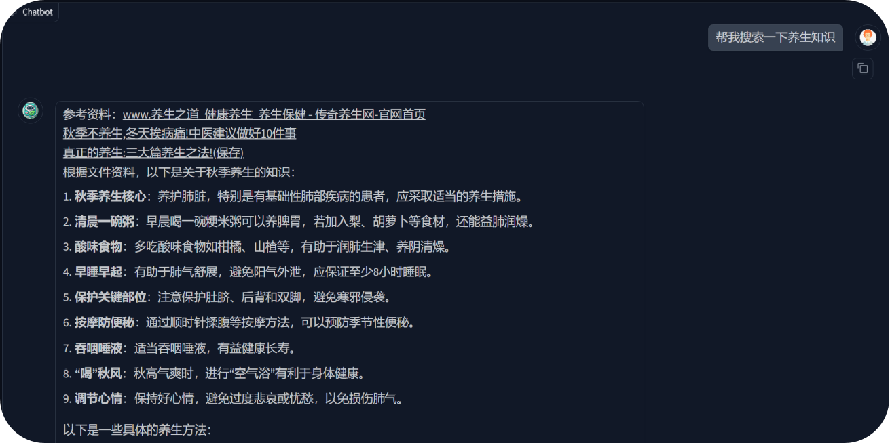

<div align="center">

</div>

<h1 align="center">"赛博华佗" 🩺 cyber-doctor is your health butler</h1>

**Language**

- [English](./README_en.md)
- [中文](./README.md)

---


## Project demonstration video

https://www.bilibili.com/video/BV1CU2aYpEn2

## Project background

The imbalance in healthcare resources has long been a key issue of concern in society, leading to numerous incidents of healthcare inequality. People in relatively underdeveloped regions often need to travel to major cities to access high-quality medical resources, which is not only time-consuming, laborious, and costly but also greatly impacts their basic rights to receive medical assistance. Currently, with the continuous development of multimodal large language models, they have seen promising applications in various fields. Based on the Southeast University summer internship program, our team has developed a multimodal large model in the healthcare domain. The target users of this model are anyone concerned about their health, assisting in basic disease diagnosis, medical record analysis, and answering professional knowledge questions. In a narrow sense, this project can serve as a multifunctional health assistant, helping to manage personal health and provide basic medical advice; in a broader sense, it can be deployed in any field, enabling the large model, through fine-tuning and RAG technology, to acquire domain-specific knowledge and become an expert in any specialized field.

## Interface display

### Text communication interface



### Voice dialogue interface



## Features

- **Multi-functional multi-modal integration, using AI agents to judge the type of tasks, integrate multiple models to solve complex problems. **
- **Separate voice dialogue module, voice input and voice output, can be used only if you can speak, reducing the cost of large model learning. **

## Function introduction



| Function                      | Function introduction                                                                                                                                                                                           |
| ----------------------------- | --------------------------------------------------------------------------------------------------------------------------------------------------------------------------------------------------------------- |
| Image recognition             | Recognize images and text in pictures with the help of multi-modal large model capabilities. Can be used to identify medical records, identify drug instructions, etc.                                          |
| Video generation              | Use the power of multi-modal large models to generate videos                                                                                                                                                    |
| Image generation              | Use the ability of multi-modal large models to generate images                                                                                                                                                  |
| ppt/word generation           | Can automatically generate fixed-format plain text PPT and Word documents                                                                                                                                       |
| Multiple rounds of dialogue   | With memory function, all contents of the dialogue interface will be entered into the large model as a historical record                                                                                        |
| Search enhanced dialogue      | The multi-modal input box can not only enter text, but also upload files. Large models adjust output based on file content                                                                                      |
| Voice input                   | Multi-modal input box can upload audio files. Enter the voice conversation mode to directly use the microphone for voice input                                                                                  |
| Voice output                  | When the large model is required to output in the form of voice, the large model will return a piece of audio, supporting multiple dialects. In the voice dialogue mode, the default output is in language form |
| Knowledge graph enhancement   | Supports the configuration of neo4j knowledge graph in related fields, and uses professional knowledge to improve large model output                                                                            |
| Knowledge base enhancement    | Supports the use of files in multiple formats as a dedicated knowledge base, and large models will be combined with files in the knowledge base for output                                                      |
| Network retrieval enhancement | Retrieve relevant information on the network through automated crawlers, and use the network to enhance the timeliness of large model knowledge                                                                 |

## Typical function display

### Medical record identification



### PPT/Word generation





### Knowledge graph retrieval enhancement:



### Network search enhancements:



## Technology stack

- **Python**
- **PyTorch**
- **Transformers**
- **Gradio**: simple UI and interaction generation tool
- **Langchain**: Based on the Langchain framework, build a language model for chain operations
- **modelscope & huggingface**: download and configuration of pre-trained large models
- **RAG**: a technology that combines retrieval and generation to enhance the answer quality of generative models
- **Knowledge Graph (Neo4j)**: Neo4j graph database configuration and Cypher statement operations
- **TTS (edge-tts), STT (whisper)**: speech to text, text to speech
- **OpenAi & zhipuai**: Related large model sdk calling methods

Option:

- **Ollama**: local large model api encapsulation

## How to start a project

1. **Pull the project from Github**

   ```
   git clone https://github.com/Warma10032/cyber-doctor.git
   or
   git clone git@github.com:Warma10032/cyber-doctor.git
   ```
2. **Configure large model API**

   Copy `.env.example` to `.env` and fill in the relevant API configuration in `.env`.

   The API currently supported:

   [Zhipu AI(click to apply)](https://open.bigmodel.cn/)

   OpenAI (not tested, but the code use openai's sdk, theoretically useful)

   Ollama encapsulated local API

   Since the team itself lacks the ability to apply for/test multiple APIs, there may be various bugs. **You are welcome to raise relevant issues and merge to solve API adaptation problems. Your actions are the greatest help to the open source community.**
3. **Fill your `config/config-web.yaml` configuration file**
4. **Create a python environment (python>=3.10, 3.10 is recommended)**

   It is recommended to use conda to manage the environment

   ```bash
   conda create --name myenv python=3.10
   conda activate myenv
   ```

   Install dependent libraries

   ```bash
   pip install -r requirements.txt
   ```
5. **Start Project**

   ```basbashh
   python app.py
   ```

   After startup, visit http://localhost:7860

Option:

1. **Download Neo4j graph database (required for using knowledge graph search enhancements)**

   Recommended tutorials:

   - [Windows](https://blog.csdn.net/jing_zhong/article/details/112557084)
   - [Docker](https://cloud.baidu.com/article/3314714)

   remind:

   - The free community version is enough and can create a graph database
   - Remember username and password when creating
   - Fill in the config/config-web.yaml configuration file
   - Remember to start the Neo4j service
2. **Configure a graph database in a professional field**

   Recommended open source knowledge graph platform: [OpenKG](http://openkg.cn/datasets-type/)

   If you want to configure a database in the medical and health field, it is recommended to download the following open source knowledge graph

   - [A knowledge graph for common household diseases](http://data.openkg.cn/dataset/medicalgraph) (This project uses this KG but its language is Chinese. You can use this KG without changing the related configuration files of config/config-web.yaml)

   1. After downloading, change the name of the .dump file to the name of the database you want to import (eg: neo4j.dump)
   2. Close neo4j service

      ```bash
      Windows: neo4j stop
      Linux: sudo neo4j stop
      ```
   3. Run the import command (I can’t find the correct tutorial on the Simplified Chinese Internet for this step😡)

      ```bash
      neo4j-admin database load <database-name> --from-path=/path/to/dump-folder/ --overwrite-destination=true
      ```

      `--from-path`: Folder path to store the corresponding "database-name".dump file

      `--overwrite-destination`: **Note that the data in your original database will be overwritten**
   4. outputs after running the above command

      ```bash
      The loaded database 'neo4j' is not on a supported version (current format: AF4.3.0 introduced in 4.3.0). Use the 'neo4j-admin database migrate' command
      ```

      You also need to run the following command

      ```bash
      neo4j-admin database migrate <database-name>
      ```
   5. Start neo4j service

      ```bash
      Windows: neo4j start
      Linux: sudo neo4j start
      ```

## Project structure

**If you want to construct an English-based LLM, you need to change the code that I marked by 'feature engineering'. Because all the feature engineering is based on Chinese. What's more, the audio module is also based on Chinese.**

```
cyber-doctor/
├── .env                            # Environment configuration file, storing API keys, model configurations and sensitive information
├── .env.example                    # Example environment configuration file, showing required environment variables
├── .gitignore                      # Git version control ignore file configuration
├── LICENSE                         # Project license file
├── README.md                       # Project documentation in Chinese
├── README_en.md                    # Project documentation in English
├── __init__.py                     # Python package initialization file
├── app.py                          # Project startup file, builds Gradio interface, processes multi-modal information, customizable ASR model and interface
├── env.py                          # Encapsulates interface for reading .env files
├── requirements.txt                # Project dependency package list
├── Internet/                       # Internet search related function module
│   ├── __init__.py                   # Package initialization file
│   ├── Internet_chain.py             # Internet search chain, coordinates keyword extraction, search crawling and retrieval process
│   ├── Internet_prompt.py            # Large model feature engineering, extracting search keywords
│   └── retrieve_Internet.py          # Calls model/Internet interface to retrieve search results
├── README/                         # Stores project documentation related resources
├── audio/                          # Audio processing related function module
│   ├── __init__.py                   # Package initialization file
│   ├── audio_extract.py              # Large model feature engineering, extracting TTS target text and language
│   └── audio_generate.py             # Encapsulates edge-tts voice synthesis interface calls
├── client/                         # Large model client module, serves as bridge between user and API
│   ├── __init__.py                   # Package initialization file
│   ├── LLMclientbase.py              # Large model client base class definition
│   ├── LLMclientgeneric.py           # Encapsulates function for calling large model API interface for dialogue generation
│   ├── clientfactory.py              # Encapsulates factory class for building different large model clients
│   ├── ourAPI/                       # Custom API interface implementation
│   │   ├── __init__.py                 # Package initialization file
│   │   └── client.py                   # Custom API client implementation
│   └── zhipuAPI/                     # Zhipu AI API implementation
│       ├── __init__.py                 # Package initialization file
│       └── client.py                   # Zhipu AI client implementation
├── config/                         # Configuration file directory
│   ├── __init__.py                   # Package initialization file
│   ├── config-web.yaml               # Application configuration file for different (Web) development environments
│   └── config.py                     # Configuration loading and processing module
├── kg/                             # Knowledge graph related function module
│   └── Graph.py                      # Knowledge graph object implementation
├── model/                          # Model related function modules used for retrieval, including Internet RAG, Knowledge Base RAG, Knowledge Graph RAG
│   ├── __init__.py                   # Package initialization file
│   ├── model_base.py                 # Model base class definition
│   ├── Internet/                     # Internet RAG vector store implementation
│   │   ├── __init__.py                 # Package initialization file
│   │   ├── Internet_model.py           # Builds Internet RAG vector store
│   │   └── Internet_service.py         # Internet RAG vector store interface
│   ├── KG/                           # Knowledge Graph RAG matching automaton implementation
│   │   ├── __init__.py                 # Package initialization file
│   │   ├── data_utils.py               # Knowledge graph data processing tools
│   │   ├── search_model.py             # Builds Knowledge Graph RAG matching automaton
│   │   └── search_service.py           # Knowledge Graph RAG matching automaton interface
│   └── RAG/                          # Knowledge Base RAG vector store implementation
│       ├── __init__.py                 # Package initialization file
│       ├── retrieve_model.py           # Builds Knowledge Base RAG vector store
│       └── retrieve_service.py         # Knowledge Base RAG vector store interface
├── ppt_docx/                       # PPT and Word document generation module
│   ├── docx_content.py               # Large model generates Word content
│   ├── docx_generation.py            # Converts Word content to Word document
│   ├── ppt_content.py                # Large model generates PPT content
│   └── ppt_generation.py             # Converts PPT content to PPT document
├── qa/                             # QA system core module
│   ├── __init__.py                   # Package initialization file
│   ├── answer.py                     # Generates answers by selecting corresponding tool functions based on question type
│   ├── function_tool.py              # Tool function collection
│   ├── prompt_templates.py           # Prompt template definitions
│   ├── purpose_type.py               # Question type definitions
│   └── question_parser.py            # Question type parsing and judgment
├── rag/                            # Retrieval Augmented Generation module
│   ├── __init__.py                   # Package initialization file
│   ├── rag_chain.py                  # RAG chain call implementation
│   └── retrieve/                     # Retrieval functionality implementation
│       ├── __init__.py                 # Package initialization file
│       └── retrieve_document.py        # Document retrieval implementation
└── resource/                       # Resource file directory, stores images and other static resources
```

## Project status

The project was originally separated from a Django+Vue framework. During development, we designed a simple front-end and back-end framework and interface. It provides basic functions such as login, registration, creating a user’s own knowledge base, and interactive operations like adding, deleting, modifying, and querying the knowledge base. However, since I was not responsible for this part, I’m not quite familiar with how to guide others in configuring this part of the code. If anyone wants this project to offer these functionalities, feel free to give feedback, and I will update the project accordingly.

You may have noticed that this project seems like a bit of a patchwork, stitching together many different features. However, there is still a lot of room for optimization in each individual function.

For example, in the processing of the knowledge graph, it currently only matches all entities and the relationships directly connected to those entities. In fact, we can enhance it by incorporating relationship type judgments, optimizing the impact of the knowledge graph on the model output, and avoiding interference with the model's responses. These improvements will be made when I have time, and your opinions and suggestions are also welcome. Stay tuned!

## Contributors

Thanks to the following members for their contributions to the project

Team members:

- [YM](https://github.com/YM556)
- [L-MARK](https://github.com/L-MARK)
- [Goku-30](https://github.com/Goku-30)
- [laobaishui](https://github.com/laobaishui)

Great gods in the open source field (except me):

<a href="https://github.com/Warma10032/cyber-doctor/contributors">
</a>

## Reference Project

This project refers to the following open source projects and thanks them/their efforts

- [meet-libai](https://github.com/BinNong/meet-libai)

## Star History

<a href="https://star-history.com/#warma10032/cyber-doctor&Date">
 <picture>
   <source media="(prefers-color-scheme: dark)" srcset="https://api.star-history.com/svg?repos=warma10032/cyber-doctor&type=Date&theme=dark" />
   <source media="(prefers-color-scheme: light)" srcset="https://api.star-history.com/svg?repos=warma10032/cyber-doctor&type=Date" />
   
 </picture>
</a>
